# Project Overview

## Table of contents

-  [Overview](#overview)
   -  [Features](#features)
   -  [Screenshots](#screenshots)
   -  [Links](#links)
-  [My process](#my-process)
   -  [Built with](#built-with)
   -  [What I learned](#what-i-learned)
   -  [Continued development](#continued-development)
   -  [Useful resources](#useful-resources)
-  [Author](#author)

## Overview

### Features

Users should be able to:

- See all countries from the API on the homepage
- Search for a country using an `input` field
- Filter countries by region
- Click on a country to see more detailed information on a separate page
- Click through to the border countries on the detail page
- Toggle the color scheme between light and dark mode *(optional)*

### Screenshots

***Desktop Layout*** (1440 X 900)\
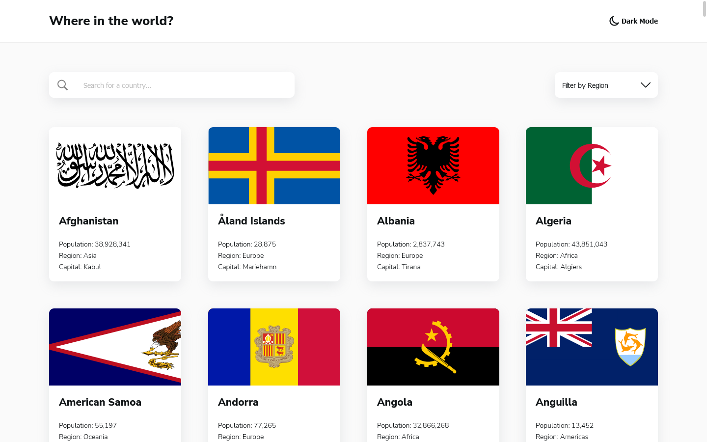
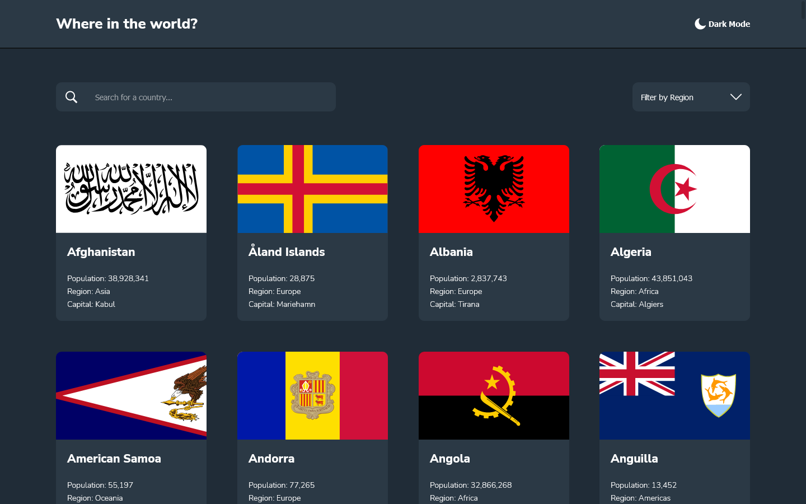
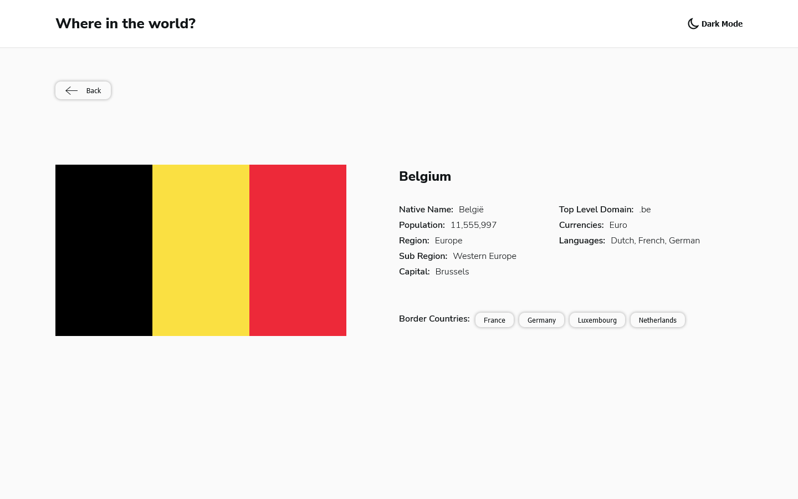
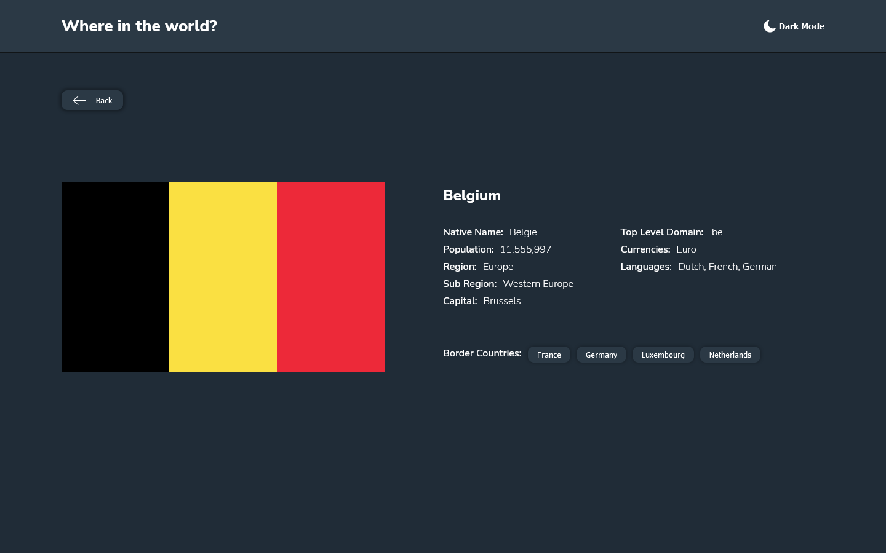

***Tablet Layout*** (768 x 1024)\
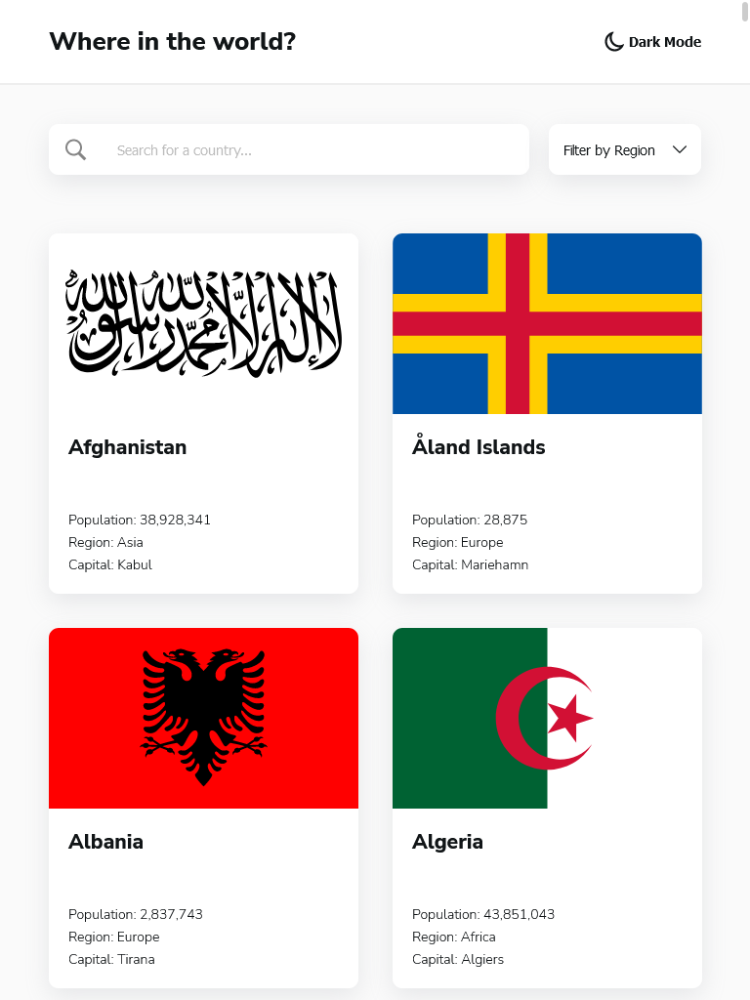
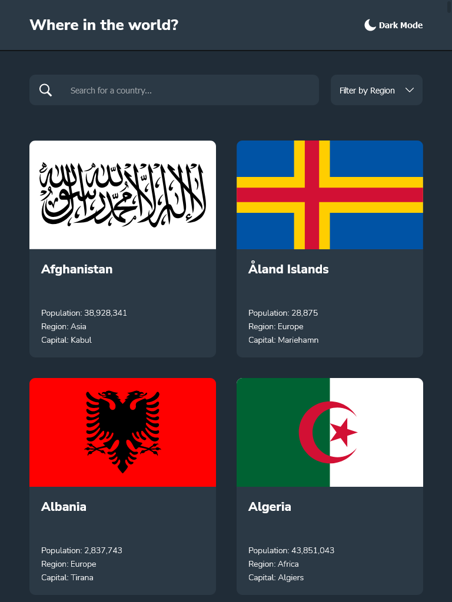
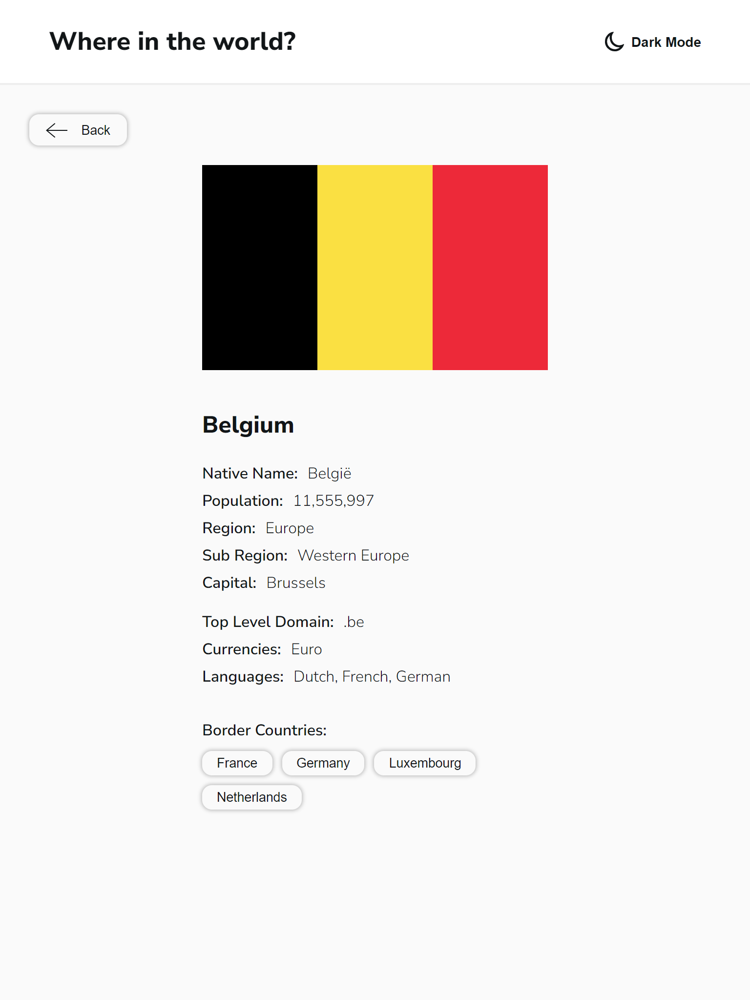
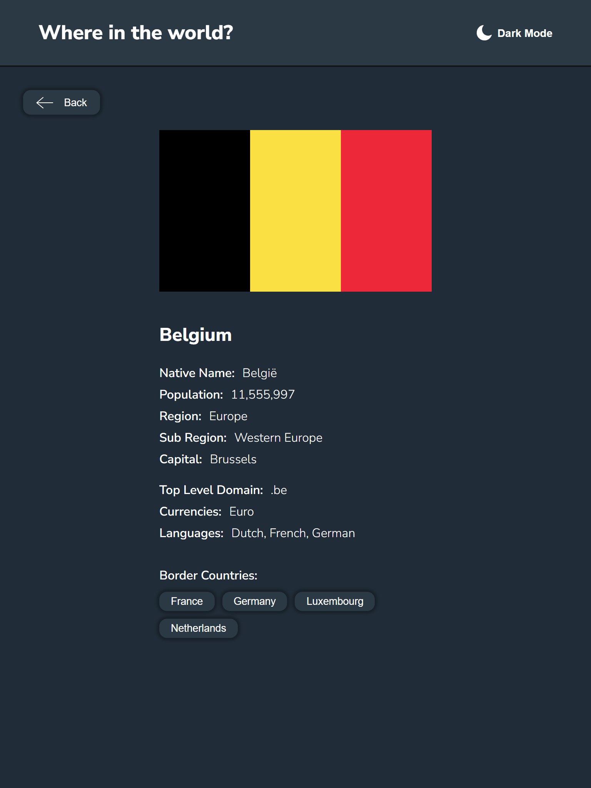

***Mobile Layout*** (375 x 667) \
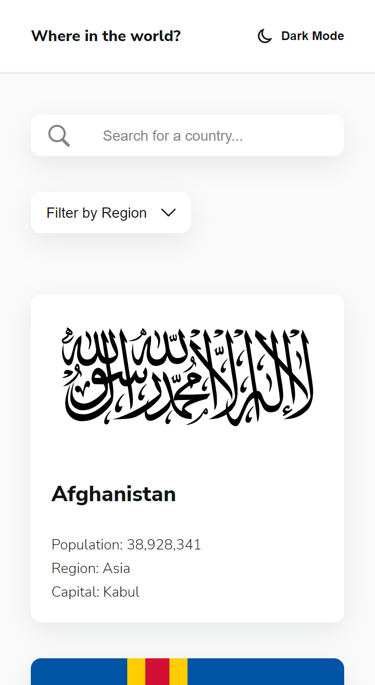
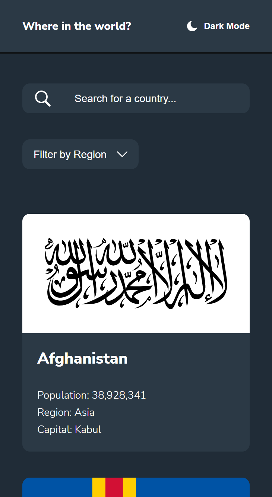
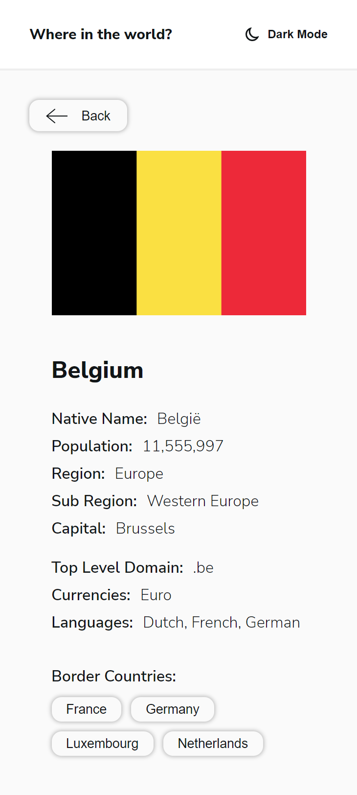
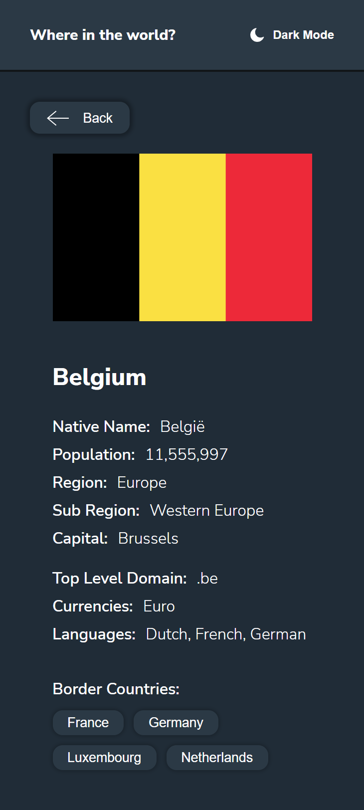

### Links

- Solution URL: [Github Respository](https://github.com/jordan-na/country-search-api-single-page.git)
- Live Site URL: [Hosted on Github Pages](https://jordan-na.github.io/country-search-api/)

## My process

### Built with

- Semantic HTML5 markup
- CSS custom properties
- Flexbox
- CSS Grid
- Desktop-first workflow
- Vanilla JS
- ES6 module patterns with IIEF's

### What I learned

-  Non-technical skills:

   -  How to turn an abstract concept into concrete results by breaking the task at hand into smaller tasks
   -  Ability to plan and stick to a work schedule with an estimated date of completion
      -  Day 1: Create desktop design (HTML, CSS)
      -  Day 2: Create mobile design (HTML, CSS)
      -  Day 3: Implement vanilla JS
   -  Perserverance to finish the task, even through challenging times

-  Technical skills:
   -  Responsive UI/UX development
      -  Using the chrome inspector to emulate different screen sizes
   -  Using CSS grid to create responsive and dynamic layouts
   -  CSS media queries
   -  Using javascript to allow single page functionality
   -  Handle API requests/responses
   -  Create single page functionality
   -  Module design patterns to allow code reusability, organization, and readability
      -  *event-handler.mjs*: Responsible for setting up events
      -  *search-input-controller.mjs*: Responsible for callback logic on search events, including when a user presses enter or the search button
      -  *region-selection-controller.mjs*: Responsible for callback logic on changing the region filter
      -  *theme-controller.mjs*: Responsible for changing the theme from light mode to dark mode and vice versa
      -  *ui-controller.mjs*: Responsible for updating the UI, including the grid of country cards and showing error messages on failed GET requests to the API
      -  *page-loader.mjs*: Responsible for providing the functions to change the page from the country grid to the country page and vice versa

### Continued development

-  I will continue to refine my vanilla JS and no-framwork CSS approach before moving onto libraries/frameworks
-  After I have complete a multitude of no library/framework projects, I will learn _React_ and implement it with my knowledge of _Node.js_ and _Express.js_
- Eventually, the goal is to complete a full stack web app that has a use for society

### Useful resources

-  [MDN](https://developer.mozilla.org/en-US/docs/Web/JavaScript) - This helped me by acting as a reference for the built in js API
-  [REST Countries V2 API](https://restcountries.com/#api-endpoints-v2) - The documentation for the API that was used

## Author

-  Name: Jordan Na
-  Website - [Github Profile](https://github.com/jordan-na)
-  Frontend Mentor - [@jordan-na](https://www.frontendmentor.io/profile/jordan-na)
-  Email - jordster02@gmail.com